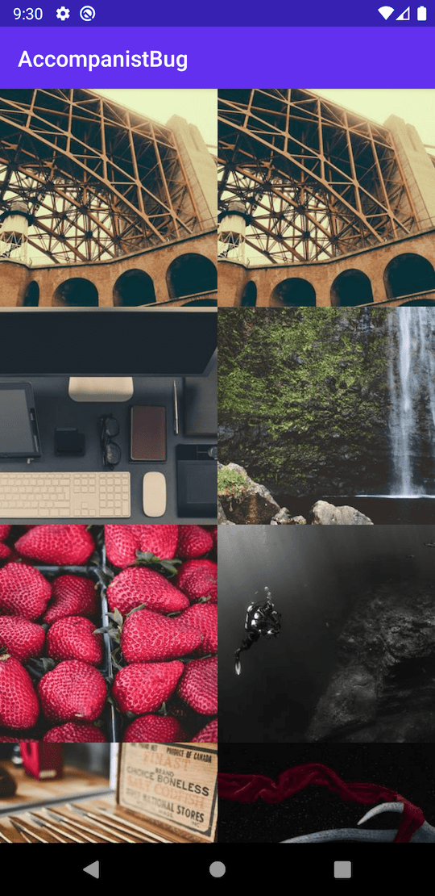

When using fragments in accompanist's image loader and Composable, the behavior is incorrect at the first display.

Condition

1. AndroidView + FrameLayout + Fragment combination
2. Use accompanist's image loader inside Fragment

| Before touch | After touch |
| :--: | :--: |
|  |  |